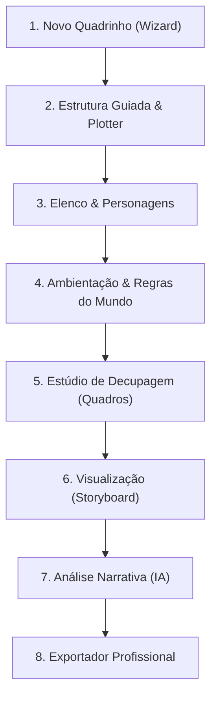

# Manual Metodológico e Guia de Uso: Narrativa Gráfica Pro

Bem-vindo ao guia definitivo do **Narrativa Gráfica Pro**, uma ferramenta desenvolvida especificamente para o ensino de roteirização e narrativa visual. Este manual serve como uma apostila completa para professores e alunos da nona arte, combinando o passo a passo técnico do software com os principais fundamentos teóricos dos grandes mestres das histórias em quadrinhos e da dramaturgia.

---

## 🗺️ Visão Geral do Fluxo de Trabalho (Workflow)

A criação de um quadrinho de excelência segue um processo estruturado que vai da ideia bruta à exportação profissional. O aplicativo está organizado exatamente para refletir esse fluxo:

---

## 💻 Varredura Completa dos Módulos do Aplicativo

### 1. Início (Painel Geral)
A mesa de trabalho principal funciona como o hub de controle do seu projeto.
*   **Gestão de Projetos:** Permite criar novos roteiros a partir do assistente (*Wizard*) ou alternar entre projetos ativos salvos localmente no navegador.
*   **Presets Profissionais:** Caso cometa erros ou queira demonstrar estruturas prontas para seus alunos, use o botão **"Restaurar Presets"**. O aplicativo vem pré-configurado com três exemplos didáticos:
    *   *Beco das Sombras* (um suspense policial Noir clássico).
    *   *Deuses do Cosmos* (uma ficção científica cósmica).
    *   *Aventuras de Tico & Juju* (uma tirinha de humor infantil leve).

---

### 2. Estrutura Guiada (Módulo de Arquitetura Narrativa)
Este módulo é a fundação da história, dividido em três painéis principais:

#### A. Sondagem Guiada
Antes de desenhar ou escrever falas, o roteirista deve responder às perguntas essenciais baseadas em **Robert McKee** e **John Truby**:
1.  **Protagonista:** Quem conduz a ação (vulnerabilidades e desejos paralelos).
2.  **Desejo:** O objetivo consciente que empurra a física do roteiro.
3.  **Obstáculo:** O oponente principal e as barreiras externas/internas.
4.  **Conflito Central:** O choque moral no cerne da obra.
5.  **Risco:** O que desmorona em caso de falha do protagonista.
6.  **Transformação Emocional:** A mudança existencial do herói após o clímax.

#### B. Batidas Dramáticas
Nesta seção, o usuário alinha sua história aos marcos estruturais de renomados teóricos dramáticos:
*   **3 Atos (Robert McKee):** Equilíbrio clássico dividido em *Ato I (Status Quo e Incidente Incitador)*, *Ato II (Complicações)* e *Ato III (Clímax e Resolução)*.
*   **Beat Sheet (Blake Snyder / Save the Cat):** Estrutura focada em ritmo acelerado com 8 pontos essenciais como *Opening Image, Catalyst, Debate, Midpoint, All is Lost* e *Finale*.
*   **7 Passos Orgânicos (John Truby):** Foco na moralidade do personagem e na rede de oponentes (*Necessidade, Desejo, Oponente, Plano, Batalha, Autorrevelação, Novo Equilíbrio*).
*   **Jornada do Herói (Joseph Campbell):** Estrutura mítica clássica de 12 etapas para grandes aventuras e transformações profundas.
*   **Estrutura Episódica:** Excelente para capítulos de séries procedurais ou webcomics contínuas (*Status Quo, Incidente, Complicações, Clímax, Gancho*).
*   **Estrutura de Tirinhas:** Foco em gags e andamento rápido de humor (*Premissa, Complicação e Punchline*).

#### C. Decupador de Argumento (Plotter)
O coração da pré-produção. Este painel permite inserir uma sinopse textual e definir a quantidade de páginas que a história ocupará (até 300 páginas).
*   **Geração por Fórmula Rápida (Offline):** Divide o argumento de forma imediata e proporcional de acordo com a estrutura dramática selecionada.
*   **Geração com Inteligência Artificial (Gemini):** Caso o `.env` esteja configurado, o Gemini distribui os eventos do argumento página a página de forma inteligente.
*   **Interatividade Total:** O usuário pode acrescentar páginas, remover, alterar títulos e definir a **Intensidade Emocional** (Baixa, Média, Alta, Clímax) de cada página individualmente.
*   **Aplicação no Roteiro:** Clicando em *"Aplicar Decupagem ao Roteiro Ativo"*, as notas de ritmo de cada página do roteiro principal serão atualizadas, transferindo a estrutura para a fase de escrita.

---

### 3. Elenco (Módulo de Personagens)
Define as fichas e os arquétipos humanos da HQ.

| Campo de Ficha | Função Teórica / Didática |
| :--- | :--- |
| **Nome & Arquétipo** | Define a função dramática (ex: Mentor, Sombra, Alívio Cômico). |
| **Desejo & Medo** | O motor de ação e o limite de pânico do personagem. |
| **Fraqueza & Personalidade** | As falhas morais e psicológicas que dão profundidade ao elenco. |
| **Aparência & Expressão** | Essencial para orientar o desenhista (roupas, reações e maneirismos). |
| **Rede de Relações** | Como este personagem entra em atrito com os outros. |

---

### 4. Ambientação (Worldbuilding)
Espaço reservado para a geografia física, estética e sociopolítica da história.
*   **Regras do Mundo:** Estabelece a lógica e limites da física, magia ou tecnologia.
*   **Clima Visual & Arquitetura:** Detalhamento do tom expressionista, gótico, ensolarado ou futurista das locações.
*   **Paleta de Cores Integrada:** Permite cadastrar os códigos hexadecimais de cores do projeto (que ficam disponíveis no editor de roteiros como botões de cópia rápida para o roteirista incluir indicações de colorização nas notas técnicas).

---

### 5. Estúdio de Decupagem (Script Editor)
Onde a história é escrita quadro a quadro. É a ferramenta mais densa do aplicativo, projetada com quatro modos de escrita distintos para atender a diferentes focos e níveis de aprendizado:

#### Os Modos de Escrita:
1.  **Simples:** Escreva com foco no básico — a descrição da imagem (ação) e os diálogos/falas. Ideal para alunos iniciantes.
2.  **Profissional (Pro):** Abre campos expandidos para detalhamento de *Dinâmica da Câmera*, *Clima/Emoção*, *Onomatopeias (SFX)*, *Recordatórios* e *Notas ao Ilustrador*.
3.  **Visual:** Oculta os inputs textuais e exibe um mockup visual com wireframe do quadro ativo, permitindo focar na representação cênica da página.
4.  **Tirinha (Strip):** Altera o layout para horizontal, exibindo os quadros lado a lado como em tirinhas tradicionais de jornal.

#### Doutrina das Transições entre Quadros (Teoria de Scott McCloud):
Para cada quadro, o aplicativo incentiva o roteirista a planejar a transição a partir do painel educacional:
*   **Momento-a-Momento:** Mudanças mínimas de tempo (ex: o fechar de um olho em close). Aumenta o suspense.
*   **Ação-a-Ação:** Personagem realizando uma ação física linear (ex: soco -> queda). Dinâmica principal de cenas cinéticas.
*   **Tema-a-Tema:** Muda o foco de um elemento para outro dentro do mesmo lugar (ex: um revólver apontado -> o suor escorrendo no rosto da vítima).
*   **Cena-a-Cena:** Grandes elipses e saltos de tempo e espaço (ex: "10 anos depois...").
*   **Aspecto-a-Aspecto:** Detalhes soltos do ambiente para estabelecer atmosfera e clima (ex: folhas caindo -> poça de água -> céu cinzento). Muito comum no mangá.

#### Técnicas de Composição de Painel e Câmeras:
O editor integra presets de **Enquadramento** (Plano Geral, Close-up, Plongée, Contra-plongée, POV, Dutch Angle) e **Técnicas de Composição** (Regra dos Terços, Linhas-guia, Silhueta, Peso Visual, Simetria). O usuário pode clicar nas técnicas para injetar dicas estruturais automaticamente nas notas do ilustrador.

#### Assistência Criativa (IA):
Através do Gemini, o editor fornece três ferramentas rápidas em tempo real:
*   *Melhorar Diálogo:* Reescreve falas soltas para dar naturalidade e subtexto.
*   *Sugerir Onomatopeias:* Analisa a descrição da ação e sugere 3 onomatopeias curtas de impacto.
*   *Sugerir Enquadramentos:* Analisa o texto de cena e escreve instruções de posicionamento de câmera baseadas em técnicas de cinema e quadrinhos.

---

### 6. Visualização & Layout (Storyboard)
Exibe a estrutura física da página com a distribuição geométrica dos quadros.
*   Permite visualizar em tempo real se a quantidade de quadros por página está equilibrada (o recomendado na literatura de quadrinhos é não ultrapassar 6 quadros por página comum para manter a fluidez de leitura).

---

### 7. Análise Narrativa (IA)
Este módulo atua como uma banca de avaliação automatizada. O Gemini faz uma varredura completa nas páginas escritas no aplicativo e devolve:
*   **Gráfico de Curva Emocional:** Um gráfico de linha mapeando a intensidade de drama e tensão ao longo das páginas do roteiro.
*   **Pontuação de Ritmo (Pacing Score):** Medição de 1 a 100 de quão dinâmico está o roteiro.
*   **Densidade Textual:** Classifica se o roteiro possui balões demais (High Density) ou se está equilibrado visualmente.
*   **Visual Clarity:** Analisa se as transições e enquadramentos escolhidos permitem uma leitura fluida da cena.

---

### 8. Escola de Quadrinhos (Didática Integrada)
Um verdadeiro banco de estudos integrado ao software, dividido em:
1.  **Enciclopédia de Referências:** Fichas biográficas detalhadas e pilares intelectuais de Will Eisner, Scott McCloud, Robert McKee, Brian Michael Bendis, Frank Miller, Stan Lee, Jack Kirby, Mauricio de Sousa e Ziraldo.
2.  **Microaulas Didáticas:** Aulas práticas com tutoriais diretos sobre *Ritmo da Página (Pacing)*, *Criação de Ganchos (Cliffhangers)*, *Uso do Silêncio Narrativo*, *Diagramação* e *Criação de Impacto Visual*.

---

### 9. Exportador Profissional
Quando o roteiro estiver pronto, ele pode ser compilado e exportado. O grande destaque é o **Exportador de PDF**, que oferece três presets de formatação visual de nível profissional:
*   **Clássico Courier:** O padrão tradicional de roteiro de cinema/TV adaptado para quadrinhos, usando fonte monoespaçada e falas centralizadas com recuos.
*   **Sleek Helvetica (Minimalista):** Design contemporâneo limpo com linhas finas e divisórias geométricas modernas.
*   **Grade de Estúdio (Técnico):** O modelo de duas colunas mais utilizado por editoras e estúdios profissionais de quadrinhos, dividindo as instruções de câmera e som da ação visual pura e diálogos.

---

## 👨‍🏫 Dicas Didáticas e Planos de Aula (Para o Professor)

Como utilizar o **Narrativa Gráfica Pro** em sala de aula de forma produtiva:

### Exercício Rápido 1: A Arte da Descompressão
1.  Peça para os alunos escreverem um argumento simples de ação de 1 parágrafo no **Decupador**.
2.  Defina a paginação para **5 páginas**.
3.  Peça para que eles distribuam a ação de forma que a **Página 4** tenha a intensidade marcada como **Clímax** e contenha apenas ação física, sem diálogos (Silêncio Narrativo de Frank Miller).
4.  No **Estúdio de Decupagem**, eles devem detalhar essa sequência usando transições de *Ação-a-Ação* ou *Momento-a-Momento*.

### Exercício Rápido 2: A Regra de Ouro do Diálogo
1.  Utilizando a aula de **Brian Michael Bendis** no módulo *EduCenter*, ensine sobre economia textual.
2.  Peça aos alunos que escrevam uma cena de diálogo longo e, em seguida, utilizem o botão de IA **"Melhorar Diálogo"** para limpar redundâncias.
3.  O objetivo é que nenhum balão tenha mais de **35 palavras**.

### Exercício Rápido 3: Traduzindo Emoção em Câmera
1.  Proponha uma cena em que um personagem está com muito medo de outro.
2.  Os alunos devem diagramar 3 quadros.
3.  Instrua os alunos a usar enquadramentos de **Contra-plongée** para o perseguidor (para dar gigantismo) e **Plongée** ou **Close-up extremo** para a vítima (para enfatizar fobia/fragilidade).
